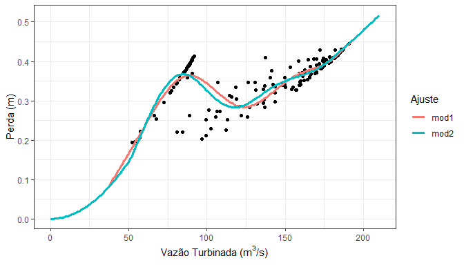
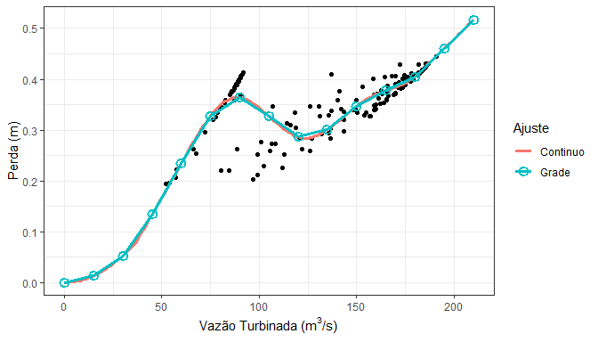

<!-- README.md is generated from README.Rmd. Please edit that file -->

# perdaprodvar

<!-- badges: start -->

[](https://github.com/lkhenayfis/gtdp-perdaprodvar/actions)
[](https://github.com/lkhenayfis/gtdp-perdaprodvar/actions)
<!-- badges: end -->

Este pacote contém o conjunto de funções necessárias para aplicação da
metodologia de perdas e produtibillidades variáveis através de modelos
aditivos. Além de funções para interface com as planilhas do GTDP e
cálculo das médias semanais, são fornecidas funções para ajuste dos
modelos, otimização dos hiperparâmetros dos mesmos, extração de grades e
otimização do número de segmentações necessárias, segundo critérios
acordados no GT Produtibillidade Hidrelétrica da CPAMP. Finalmente,
funções para visualização e diagnósticos são inclusas.

## Instalação

Este pacote ainda nao se encontra disponibilizado no CRAN, de modo que
deve ser instalado diretamente a partir do repositorio utilizando:

``` r
# Caso a biblioteca remotes nao esteja instalada, execute install.packages("remotes") primeiro
remotes::install_github("lkhenayfis/gtdp-perdaprodvar", build_vignettes = TRUE)
```

## Exemplo de uso

Abaixo esta um trecho de codigo exemplificando de forma simplificada o
uso das funcionalidades contidas neste pacote, com respeito apenas à
modelagem de perdas. Um manual de uso pode ser acessado através de
`vignette("perdaprodvar")` e mais detalhes acerca das funcoes se
encontram em suas respectivas paginas de ajuda.

``` r
library(perdaprodvar)

# exemplo de leitura de arquivo bruto (reduzido) incluido no pacote
arq <- system.file("extdata/dummyusi1.xlsx", package = "perdaprodvar")
dado_horario <- leplanilha(arq)

print(dado_horario)
#>                 datahora patamar  energia        prod    vazao nmaq    nmont
#>   1: 2016-01-01 00:00:00       L 41.78230 0.009008266 258.7321    2 59.43218
#>   2: 2016-01-01 01:00:00       L 41.78625 0.009008257 258.7409    2 59.43218
#>   3: 2016-01-01 02:00:00       L 41.76987 0.009008242 258.8035    2 59.43218
#>   4: 2016-01-01 03:00:00       L 41.78800 0.009008052 258.8831    2 59.43086
#>   5: 2016-01-01 04:00:00       L 41.76800 0.009008631 258.5681    2 59.43086
#>  ---                                                                        
#> 164: 2016-01-07 19:00:00       P 90.52850          NA   0.0000    0 59.28526
#> 165: 2016-01-07 20:00:00       P 90.51400 0.009015100 136.3348    2 59.28526
#> 166: 2016-01-07 21:00:00       M 90.81100 0.009043861 144.0066    2 59.28394
#> 167: 2016-01-07 22:00:00       M 91.73200 0.009014595 136.5289    2 59.28262
#> 168: 2016-01-07 23:00:00       M 91.51500 0.009009294 134.1383    2 59.28129
#>          perda   quedal
#>   1: 0.3888617 29.61577
#>   2: 0.3888830 29.61575
#>   3: 0.3890379 29.61560
#>   4: 0.3892387 29.61407
#>   5: 0.3884557 29.64169
#>  ---                   
#> 164:        NA       NA
#> 165: 0.1519640 30.52865
#> 166: 0.1626884 30.52555
#> 167: 0.1541361 30.57750
#> 168: 0.1499923 30.59821
```

Uma vez que o dado foi lido, podemos prosseguir para sua modelagem.

``` r

# realizacao da agregacao semanal ponderada por energia gerada
dado_semanal <- agregasemana(dummydata) # dummydata e um dado embutido no pacote para exemplos

# ajuste de modelos para perda
mod1 <- fitgam_perda(dado_semanal, ns.vazao = 7, ts.vazao = "ps")
mod2 <- fitgam_perda(dado_semanal, ns.vazao = 7, ts.vazao = "tp")

par(mar = c(4, 4, .1, .1))
plot(mod1, legenda = FALSE)
lines(mod2, col = 3, lwd = 2)
```



Finalmente, podemos extrair uma grade do modelo ajustado (neste caso com
50 segmentações)

``` r
grade_perda <- extraigrid(mod1, 50)

par(mar = c(4, 4, .1, .1))
plot(grade_perda)
```


